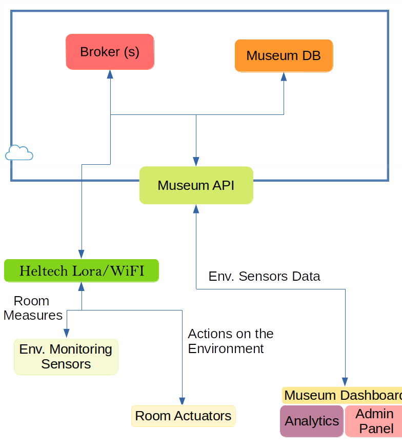
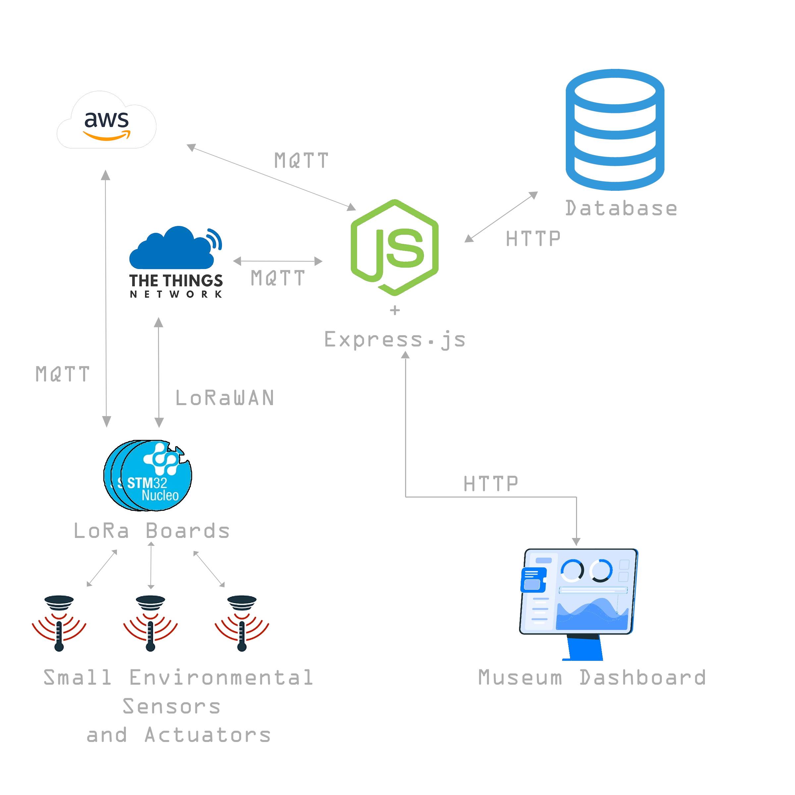

# Architecture   
This document is the second version of the architecture for the SmartMuseum project. The first version is in the [history folder](history/Architecture.md). Changes to the original architecture reflect the fact that our first project was too simple in core feature provided, not strictly related to the IoT field and also to wide. Here we decided to only focus on the specific indoor environment monitoring feature and the architecture reflects those changes. Also, here we give more attention to the IoT related architectural components.
 
## High-Level Presentation 

  

   

In principle, this is a first step for the museum through a transition into intelligent and efficient management of its resources involving two strategic areas: asset preservation and energy efficiency. Indeed, artworks conservation is a key need for a museum as pointed out during the lecture with Sapienza Museum Experts. In the meanwhile, this activity can be performed in a very smart way with the help of IoT, sensors, actuators, to reduce energy cost and to augment human awareness of the process thank to newest technologies.  
On the backend, the key concept is to develop a microservice architecture to obtain modularity and have a dynamic evolving system with a series of independent components to allow continuous integration and development.  
The system can be easily integrated with already existing services. All those microservices are accessed thanks to a middleware that exposes a uniform API for the consumers.  
The system, even if very simple in the beginning, can evolve to be very complex with very little effort and provide a variety of features and improvements.

### Nucleo Boards
The Nucleo boards used  will be in charge of collecting environmental sensors data and to send them to the Broker. Ideally, based on the received thresholds, they should also control the actuators to make the environment controlled. The board will read data with an acceptable frequency then aggregate and send them to the Broker. From the broker, the Middleware will be in charge of consuming them and store them in the DB. The API will provide a uniform interface to clients to either aggregated data(LoRaWAN)  real-time data (MQTT) and historical data (from DB).

### Broker
The broker will just collect data from the boards when published. As initial solution we will propose to the museum to collect environmental data in aggregated from (for example avg min and max temperature of a given time range). Based on this proposal we decided to use TheThingsNetwork and use their sdk to consume those data given their open source and free-to-use philosophy. Also this choice allows us to choose an energy saving policy for communication according to our needs.  
In any case, the possibility to interact with a MQTT broker is also provided, so that when a more specific measure is needed we can require it. This solution, together with the possibility of on-demand billing offered by AWS allows us to make the solution sustainable. 

### Museum API
The Middleware API exposes all the museum services, it will allow a transparent and uniform communication between things, database and dashboard. It will also easily allow to integrate new feature given its modularity structure.
It is realized in NodeJS with the Express framework.

### Museum DB
It is a non-relational database that stores all information required. In the [evaluation](Evaluation.md) part we will discuss cloud or on-premise solutions as well as particular DBs. The choice of a NoSQL database is for its non-rigid structure that allows to speed up development. However if there is any constraint on the architecture, the API can be easily adapted to talk and support whatever kind of database.

### Museum Dashboard
Thanks to the dashboard, museum's administrator will be able to monitor environmental data to preserve artworks, both realtime and historical. They will have the possibility to define alert thresholds on measures, define thresholds for actuators and will have the possibility to switch to realtime monitoring in case of anomaly. The PoC will be realized in JavaScript and we will use Bootstrap 4 or similar technology to quickly build responsive layouts. For a production development we might think to use Flutter also for a web-based dashboard.

## Components Interaction  

  

   

The backend choice between on-premise and cloud solutions will be discussed in the [evaluation](Evaluation.md) part. As initial solution we will propose to the museum to collect environmental data in aggregated from (for example avg min and max temperature of a given time range). Based on this proposal we decided to use LoRaWAN as communication protocol. If more data are needed we might switch to mqtt/mqtt-sn and change the broker accordingly. Both The Things Network and AWS IoT Brokers will interact with the NodeJS middleware with MQTT protocol. The Middleware will also act as a control layer over the data model. Inside the museum, the idea is to use cheap boards with LoRa support to interact with sensors/actuators and transmit values to the Cloud.  
The dashboard will periodically interact with the middleware using HTTP(s).