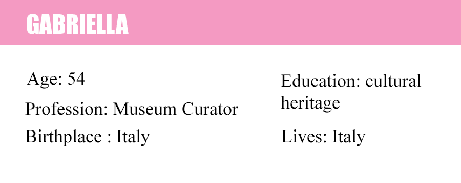
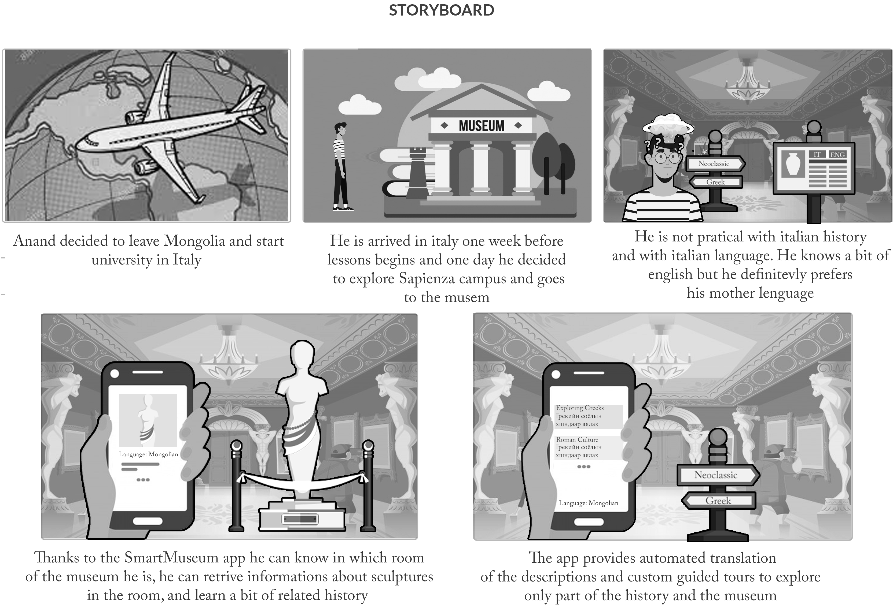

# Design

## Personas :pouting_man: :pouting_woman:

### :pouting_woman: Gabriella 

  

    

__Hard Facts__   
Gabriella is 54 years old curator of the Sapienza museum. She is Italian, she graduated in cultural heritage and then supported the master's degree in Conservation of Architectural and Environmental Heritage.
She is wife and mother of two children but above all a woman of great culture, she has an irrepressible passion for art since she was a child, she is also a great supporter of technologies in general but especially for those that  can be put at the service of her museum, in fact she would like to transform her museum into a smart museum making it as accessible and interactive as possible.  

__Interest and Value__  
Gabriella loves watching movies and going out with her family on the weekend, especially when the weather is good, she is a meteoropathic and loves summer but in winter she is more concentrated, obviously without taking away too much space for fun.
But when she wants time for her, she reads a nice book in the living room drinking tea and maybe thinking about some innovation for the museum.  

__Home, internet and tech__   
As already said gabriella is a fan of technology in fact her house is smart, all the appliances are smart: the lights, the television, the audio system, for example on Sunday morning she wakes up and asks Amazon alexa to put some relaxing music in the afternoon she asks alexa for a film to watch on smart TV and then she enjoys watching it with her family.  

__A Typical Day__   
* Wake up at 7 am, breakfast with the family.  
* She takes the kids to school.  
* Then she goes to work at 8:00 am.  
* She eats her lunch.  
*  Afternoon shift at the museum, 2 pm.  
* Then she come back at home at 6 am.  

### :pouting_man: Anand

  

   

__Hard Facts__ 
Anand is a 23 years old student of linguistic. He grew up in Mongolia and he lived there with his family untill he moved to Italy to complete his study path, and he started university there. He had a lot of friends in Mongolia and he thinks friendship is one of the most important values of its life. He spent the last summer in Russia and he had a girlfriend there, but now he is single and he is not searching for a relationship. During the trip he learned a bit of english and russian. He does not speak italian yet.     
Before leave Mongolia Anand rent a room online thanks to a platform sponsored by Sapienza University and he decided to move in Italy one week before the lessons start so that he can find a job to help his family with rent and university fees. He got a job as a dishwasher on him third day in Rome. He has not any friend in Italy yet so he decided to spent the free days left to explore the city and University Campus. However, since he is not very pratical with english and italian yet, he finds very challenging and mentally tiring to spent a day around reading and listening in foreign languages although he is very curious to learn italian history, culture and habits.  
__Interest and Values__  
He loves to read books at home at night as opposed to going out to  bars. He does like to hang out with a small group of friends at home or  at quiet coffee shops. He cares a lot about looks and  fashion.
In an average day, he tends to drink many cups of American coffee, and he  usually cooks his own healthy dishes. He prefers organic food, however, he’s not always able to afford it.  
__Computer, Internet and TV Use__    
Anand owns a PC and an iPhone. He uses the  internet for his studies to conduct the majority of his preliminary  research and studies user reviews to help him decide upon which books to  read and buy. Anand is also streaming all of his music and he watches  movies online since he does not want to own a TV. He thinks TV’s are outdated and he does not want to waste his time watching TV shows, entertainment, documentaries, or news which he has not chosen and finds 100 % interesting himself.   
__A Typical Day__  
* Anand gets up at 7 am. He eats American breakfast at home and leaves for university at 8.15 every morning. 
* Depending on his schedule, he studies by himself or attends a  class. He has 20 hours of classes at Master level every week, and he studies for 20 hours on his own.  
* He eats his lunch.
* He continues to study.
* He leaves for home at 6pm. Sometimes he continues to study 1-2 hours at home.      
* Three nights a week he works as a dishwasher at a small eco-restaurant from 6pm to 10pm.

