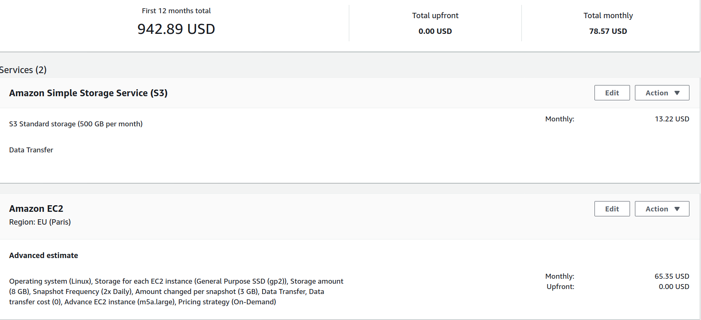

# :chart_with_upwards_trend: Evaluation 

## User Experience Evaluation
To evaluate the user experience we have designed a prototyper of the app (using Adobe XD Mockup software) and we have tested the usability of the product with some sample users.  
The prototype:  
  
  
Feedback:  
Since the period is a bit tough and there are severe limitations to social life, we restricted testing to our familiar. They found the prototype intuitive, but they suggested us to allow users to use the app even without bluetooth. New prototype:  
  

## Technical Evaluation
We have decided to realize a backend microservice architecture to allow modularity and to make system evolution simple so that the application will be as long-lasting as possible, tolerant to changes, integrable with other projects from the course easily.  
Due to Covid-19, we will test the product from a tecnichal point of view usng IoT-Lab Testbed for the indoor environmental condition monitoring  since it provieds full support to LoRaWAN and also gave access to boards with environmental sensors. Indeed we could also use it to test Beacon broadcast but It does not make much sense. So to test the mobile app we will simmulate beacons with our PC.   
  
According to the architecture we have described in the [Architecture file](Architecture.md) we are goingo to compare costs of a solution cloud based and a soluton on premise as well as required hardware costs. We assume project is open source hence no employee to pay.
### Cloud Hosting Costs 
*using AWS Pricing Calculator*:
- To host the Node.js API we use an AWS EC2 on demand instance with daily spike traffic and that can scale up to 2 instances running. We assumed a 3.30 h daily peak of traffic, 2 vCPUs, 4 GB of memory and 32 GB EBS storage. The cost per month is 60.35$ choosing one EU region.
-  To store data we use simple storage service S3, with an estimate (see database section below) of 500GB per month of storage needed with 100 PUT and 10000 GET, 100 GB of retrived data each month and 500 GB of data scanned. Total: 13.22 $
- Translation service: free
<p align="center">
  
</p>   

The same configuration will be 100$ per month on Google cloud only for hosting the app, without considering storage.   
With [Azure cost estimator](https://azure.microsoft.com/it-it/pricing/calculator/), instead, we have computed 36$ per month using azure data lake storage and app service.
<p align="center">
  
</p>   

However, 500 GB is an estimate of storage of a very big museum. A more realistic scenario for the Sapienza Classical Art Museum is a required storage of about 50GB (see tables below). Hence the major cost would be the app hosting service (60$/mo. on AWS and 20$/mo on Azure). Here we can think to switch to MongoDB Cloud data storage service, called Atlas, with a cost of 0.25$/hour on avg. (AWS, Google, Azure) for 50 GB storage instance.   
__Optimize Storage Costs__  
We can cut storage costs by not storing any audio tape. Instead we are goingo to store audio transcription and we use a text-to-speech service to reprodoce tapes. The cost of this service on google is 4$/1 million character but we can also [embedd a custom TTS engine in the android app](https://developer.android.com/reference/android/speech/tts/package-summary), hence spending nothing and reducing the database size to at most 1GB (approximation). *NB. we are trading off storage cost with more CPU power (and energy consumption) if we embedd TTS engine in the app.*

### On-Premise Costs
We assume server as well as all the required Infrastructure support (IP address, networking, DB, backup, security etc.) is provided by [InfoSapienza](https://web.uniroma1.it/infosapienza/) hence we do not need to buy anything but the hardware required by the project (ble beacons). This kind of hardware should be bought even if we choose a cloud solution, hence it is not considered here. If the assumption is true and the costs to run this applicaiton are minimum wrt all the other stuff running on the servers, this solution might be the most convenient. 

### But What if...
If  the traffic in the museum is limited, me might think to deploy the museum gateway and API with a cluster made of Raspberry PI 4B. Indeed a lot of makers are experimenting with this kind of clusters running Kubernetees and Docker containers on those devices (examples [here](https://opensource.com/article/20/3/kubernetes-raspberry-pi-k3s), [here](https://github.com/mhausenblas/kube-rpi),[here](https://github.com/codesqueak/k18srpi4),[here](https://itnext.io/building-a-kubernetes-cluster-on-raspberry-pi-and-low-end-equipment-part-1-a768359fbba3)).   The hardware is low cost (20$ for a board) and additionally we only need some ethernet cable and a switch. If we setup a cluster with 3 workers and 1 master the total cost is around 100$. [The power consumption of a board at 400% of CPU consumption is 6W](https://www.pidramble.com/wiki/benchmarks/power-consumption) (4 board consumes 0,024 KW), the price of energy is around  0,03037 €/kWh ([ref](https://tariffe.segugio.it/guide-e-strumenti/domande-frequenti/quanto-costa-un-kwh-di-energia-elettrica.aspx)), hence we should pay: ```KW * hours_of_usage * price (€/kWh) --> 0,024* 24*365 *0,03037  --> 6.4``` less than 7€ in a year. Of course, with this kind of solution we try to minimize the network traffic between the app and the server, hence we might consider the TTS (text to speech) solution described above to limit the overead to those tiny boards.

### PoC
For this prof of concept we will deploy a MongoDB instance with Atlas M0 tier (free tier for lifetime) with physical limitation of shared RAM and CPU and storage limit of 512MB. The app will be hosted locally.
 
### Required Hardware
We will use an STM NUCLEO family board. They allows to measure at the same time temperature, relative air humidity, air pressure(only some boards). Also we can either buy an [extension board](https://www.st.com/en/ecosystems/x-nucleo-idb05a1.html) to support BLE or we can buy a [board with BLE integrated](https://www.st.com/en/evaluation-tools/b-l475e-iot01a.html). This means that can this hardware is very useful also to scale the project and integrate with other projects. We estimate one beacon per room (but we can should be able to use one of it for two room either and optimize costs).


### Final Notes on Storage Volume Estimation
here a quick explanation on how we have evaluated storage requirements. 
First of all we introduce a sketch of the data model (might variy during time if some special need emerges). Among the NoSQL family we have decided to choose MongoDB because it is open-source, simple, distributed and easy to scale, can migrate easy from on premise to cloud thanks to Atlas. Hence we assume our data will be stored in BSON and we estimate sizes according to its [specification](http://bsonspec.org/spec.html).  
__Data Model__  
*Opera:*  
``` javascript
{ 
Name: "David",
author: "Michelangelo Buonarroti"
Descriptions: [ {"it" : "Il David è una scultura realizzata in marmo da ..."}, {"en" : "David is a masterpiece of Renaissance sculpture..."}, ...],
Images: {presentation:BLOB, others: [BLOB, BLOB, …]}  ,
Audios: [{language: "it", tape:BLOB}, {language: "eng", tape:BLOB}, ...] ,
Videos: [{title:"video1", video: href},{Title:"video2", video: href2}, ... ] ,
Room: 2 ,
Available: True , //(for operas borrowed to other museums or currently non available)
OnTrip: False , (for operas borrowed to other museums)
}
```
The opera object contains the name of the artwork, the author, the description (array for descriptions in any language to minimize requests to an external service), Images is an object that contains the cover image called 'presentation' and some additional (optional) images. Audio and Video are addtional (optional) resources to enrich the description. Room is the room id of the artwork so that we can query the artwork document by room. Available tells us if the artwork is availabe to the public, if false it might be on trip to another museum (hence OnTrip:True) or it might be out for restoration. Those two last fields are only example to how we can customize data model according to curators needs for future developments. 
    
*Rooms:*
```javascript
{
Number: 
Description: [{language: "it", description:"lore ipsium ..."},…]
Audio: [{language: "it", tape:BLOB},…] 
Video: href
}
```
Provides a general description of the room. We imagine a room as a logical representation of an historical epoch, a populaiton or something similar.
   
 *Paths:*
```javascript
Rooms: []
Descriptions: [{language: "it", description:"lore ipsium ..."},…]
Avg time:
Transitions: [{from_room:to_room}]
```
Paths are custom guided tour that explore only part of the museum rooms or all of them with a particular order according to some criteria defined by the curator.

  
*Traffic:*
```javascript
{
user_id:
room:
date_time:
}
```
Traffic are the user indoor tracking data (Monitoring crowding in each room). A typical query will search for the number of user into  a specific room at a given time interval of a certain day.

__Data Volume Estimation__  
From [BSON specification](http://bsonspec.org/spec.html) we can read that int32 is 4 Byte, datetime is 8 Byte, characters are utf-8 encoded hence from 1 to 4 Byte, we will consider 2 Byte as approximation. 
We will start from *Traffic* since it is the easiest one. Note that those are only rough approximations to get an idea and the actual BSON files might me larger due to uniques document ids, indexes on the collection etc...  
we assume userid is an email address and from some google search we learned that avg email size is 25 char (50 Byte). Room is an integer (4 Byte), then we have a datetime (8 Byte). Total size of one Traffic object is 62 Bytes.   
If the window is different from 1 min then we can compute the size as ```number_users * app_usage_duration (min) / msg_time_window (min) * 62```.  

| Daily users | App Usage (min) | Collection Size (1 day) in MB |
| --- | --- | --- |
| 10 | 60 | 0.04 |
| 10 | 120 | 0.07 |
| 10 | 180 | 0.11 |
| 100 | 60 | 0.37 |
| 100 | 120 | 0.74 |
| 100 | 180 | 1.12 |
| 1000 | 60 | 3.72 |
| 1000 | 120 | 7.44 |
| 1000 | 180 | 11.16 |

This is the only collection whose size will increase day by day. All the other collection will have an upper bound in the size. 
  
For the room obj we enforce one audio tape per language and one video tape. Assume 2MB for each audio tape. Video tapes will be hosted on an external service (e.g. YouTube) with subtitles and the video is embedded in the app. We have a lower bound with only one language in the db and an upper bound with 30 languages (Yandex supported languages). Size estimation formula will be: ```nr_rooms*Nr_languages*(audio_tape_size+(descr_char*2Bytes))```.
| Nr. downloaded languages | Descr Size (nr. of char) | Audio Size MB | Nr. of Rooms | Size GB |
| --- | --- | --- | --- | --- |
| 1 | 1000| 2 | 20 | 0.044 |
| 15 | 1000 | 2 | 20 | 0.660 |
| 30 | 1000 | 2 | 20 | 1.230  |
| 1 | 1000| 2 | 40 | 0.088 |
| 15 | 1000 | 2 | 40 |1.320  |
| 30 | 1000 | 2 | 40 | 2.640  |
| 1 | 1000| 2 | 60 | 0.132 |
| 15 | 1000 | 2 | 60 |1.980 |
| 30 | 1000 | 2 | 60 | 3.960 |

For the Opera Object the main contribution is given by Audio tape and images. We assume 5 image per artwrok of 400KB each, one audio tape of 2 MB and 200 KB for all the other fields. 4,2MB total.
```Nr_artworks *( (size_audio+size_other_fields)*nr_languages + size_foto*number_photo )```
| Nr. artworks| Nr. languages | Size GB |
| --- | --- | --- |
| 100 | 1 |  0.420 |
| 100 | 15 | 3.5  |
| 100 | 30 | 6.8  |
| 300 | 1 |  1.3 |
| 300 | 15 |  10.5 |
| 300 | 30 |  20.4 |
| 600 | 1 |  2.5 |
| 600 | 15 | 21.0  |
| 600 | 30 |  40.8 |
| 1000 | 1 |  4.2 |
| 1000 | 15 |  35 |
| 1000 | 30 |  68 |
| 10000 | 1 |  42 |
| 10000 | 15 |  350 |
| 10000 | 30 |  680 |
