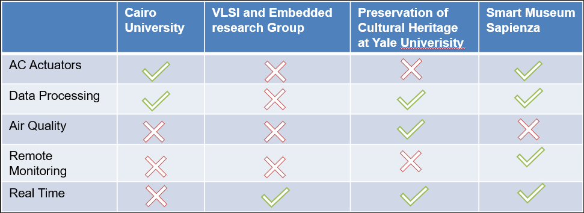
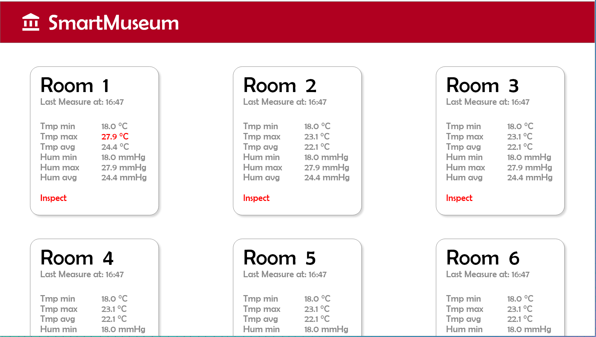
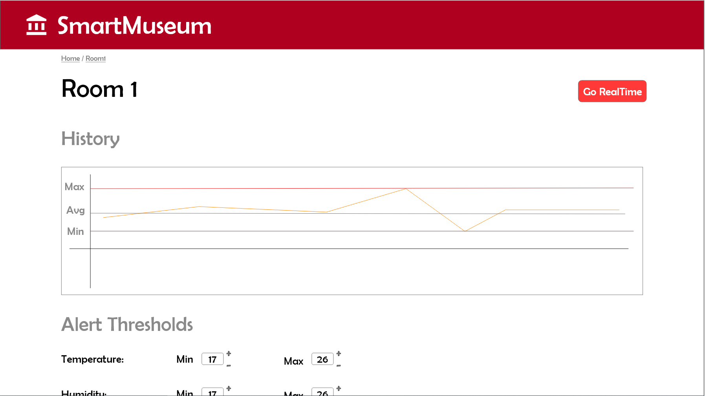
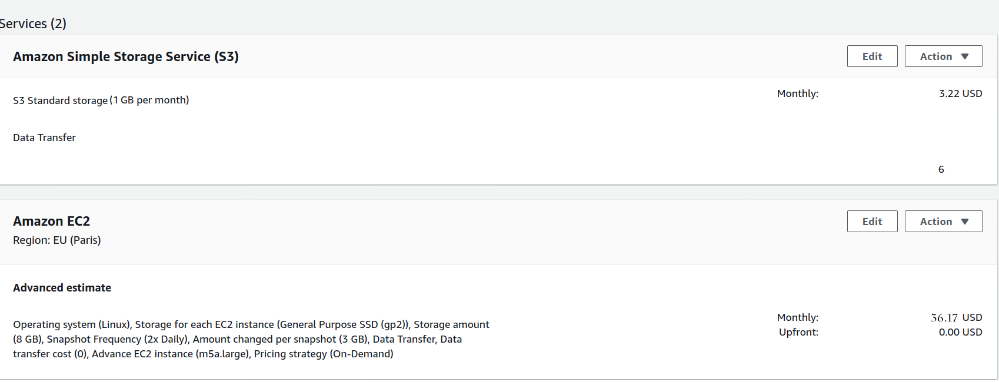
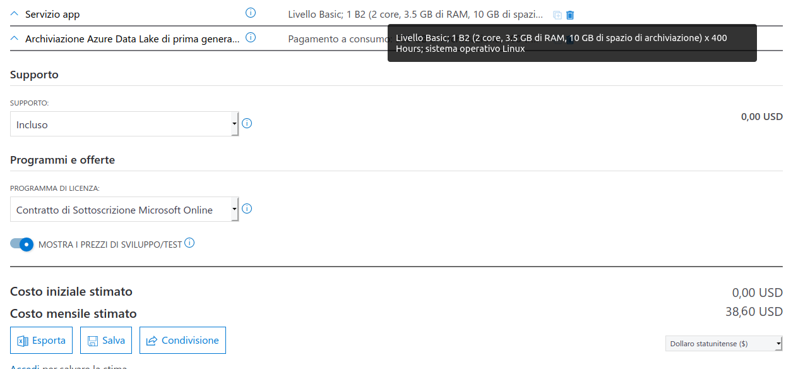

# :chart_with_upwards_trend: Evaluation 
This document is the second version of the Evaluation document for the SmartMuseum project. The first version is in the [hisory folder](history/Evaluation.md). Changes to the original evaluation reflect the fact that our first project was too simple in core feature provided, not strictly related to the IoT field and also to wide. With the second version we decided to only focus on the specific indoor environment monitoring feature. In this document, since the data exchanged changes, we evisit cloud costs. We also revisit the User Experience (UX) evaluation process since out target user change. The prototype is also updated to address this pivot.     

# Competitors analysis:

 <p align="center">
  
</p>   
Observing the competitors, the differences, the weak points and the strong points of our idea emerged. Many competitors have decided to add a module for the detection of light, we have deemed this feature useless as we will have a web platform to monitor climatic conditions asynchronously and with human in the loop. Some ideas use Excell sheets and personal computers for data processing while we will rely on a special backend and obviously the cloud. Another difference is the ability to monitor air quality  a feature that could be added in the future. The idea that comes closest to ours includes the use of actuators for room cooling but unlike us, it always transmits data in real time, obviously using a much higher amount of data than ours. Another of our strengths is the use of technologies for the monitoring of loaned works of art, none of the previous ideas allows the curators of the pieces of art to remotely monitor the quality of the environment in which the piece is located.

# User Experience Evaluation
To evaluate the user experience we have designed a prototype of the web dashboard (using Adobe XD Mockup software) and we have tested the usability of the product with some sample users.  
The prototype:  
  
And when clicking on a room we can have contextual actions and detailed measures.
  
  
Feedback:  
Since the period is a bit tough and there are severe limitations to social life, we restricted testing to our familiars and some friend. They found the prototype intuitive and easy to use.  
As a general metodology to evaluate the system we have decided to use [think-aloud interviews](https://www.refsmmat.com/notebooks/think-alouds.html). They are widely used in usability testing, education, and related fields to see how people approach tasks and then to discover errors in the UX and improve it. The evaluation process consist of give the product (the dashboard in this case) to a user and make him interact with the product saying aloud what he is trying to do and how and, eventually, why he is not able to do it.

# Technical Evaluation
We have decided to realize a backend microservice architecture to allow modularity and to make system evolution simple so that the application will be as long-lasting as possible, tolerant to changes, integrable with other projects from the course easily.  
Due to Covid-19, we will test the product from a technical point of view using IoT-Lab Testbed for the indoor environmental condition monitoring since it provieds full support to LoRaWAN and also gave access to boards with environmental sensors. 
  
According to the architecture we have described in the [Architecture file](Architecture.md) we are going to compare costs of a solution cloud based and a solution on premise as well as required hardware costs. We assume project is open source hence no employee to pay.
## Costs
### Cloud Hosting Costs 
*using AWS Pricing Calculator*:
- To host the Node.js API we use an AWS EC2 on demand instance without daily spike traffic and without scaling, since it will be accessed only by the curator. We assumed, 1 vCPUs, 4 GB of memory and 16 GB EBS storage. The cost per month is 36.17$ choosing one EU region.
-  To store data we use simple storage service S3, with an estimate (see database section below) of few MB per month of storage needed with 10000 PUT and 10000 GET, 1 GB of retrieved data each month and 1 GB of data scanned. Total: 6.22 $
- The Things network service: free
-AWS IoT Core: assumed null cost since it should be used only when anomaly values shows up, hence very few times in a year.
<p align="center">
  
</p>   

The same configuration will be 60$ per month on Google cloud only for hosting the app, without considering storage.   
With [Azure cost estimator](https://azure.microsoft.com/it-it/pricing/calculator/), instead, we have computed 38$ per month using azure data lake storage and app service and with the same assumptions as AWS IoT for IoT Hub.
<p align="center">
  
</p>   

However, storage is overestimates. This is because calculator do not allow to insert low storage volumes. A more realistic scenario for the Sapienza Classical Art Museum is a required storage of about 200 MB a year (see estimation below). Hence the major cost would be the app hosting service.

### On-Premise Costs
We assume server as well as all the required Infrastructure support (IP address, networking, DB, backup, security etc.) is provided by [InfoSapienza](https://web.uniroma1.it/infosapienza/) hence we do not need to buy anything but the hardware required by the project. This kind of hardware should be bought even if we choose a cloud solution, hence it is not considered here. If the assumption is true and the costs to run this application are minimum wrt all the other stuff running on the servers, this solution might be the most convenient. 

### But What if...
If  the traffic in the museum is limited, me might think to deploy the museum gateway and API with a cluster made of Raspberry PI 4B. Indeed a lot of makers are experimenting with this kind of clusters running Kubernetees and Docker containers on those devices (examples [here](https://opensource.com/article/20/3/kubernetes-raspberry-pi-k3s), [here](https://github.com/mhausenblas/kube-rpi),[here](https://github.com/codesqueak/k18srpi4),[here](https://itnext.io/building-a-kubernetes-cluster-on-raspberry-pi-and-low-end-equipment-part-1-a768359fbba3)).   The hardware is low cost (20$ for a board) and additionally we only need some ethernet cable and a switch. If we setup a cluster with 3 workers and 1 master the total cost is around 100$. [The power consumption of a board at 400% of CPU consumption is 6W](https://www.pidramble.com/wiki/benchmarks/power-consumption) (4 board consumes 0,024 KW), the price of energy is around  0,03037 €/kWh ([ref](https://tariffe.segugio.it/guide-e-strumenti/domande-frequenti/quanto-costa-un-kwh-di-energia-elettrica.aspx)), hence we should pay: ```KW * hours_of_usage * price (€/kWh) --> 0,024* 24*365 *0,03037  --> 6.4``` less than 7€ in a year.

### PoC
For this prof of concept we will deploy a MongoDB instance with Atlas M0 tier (free tier for lifetime) with physical limitation of shared RAM and CPU and storage limit of 512MB. The app will be hosted locally.
 
## Required Hardware
We will use some HELTEC family [board](https://heltec.org/project/wifi-lora-32/). They allows to use bluetooth, wifi and lora without addiotional extensions at the price of 10$.  
We estimate one board per room (but we should be able to use one of it for two room either and optimize costs).  
The board has a microprocessor ESP32 (dual-core 32-bit MCU + ULP core), with LoRa node chip SX1276/SX1278; Micro USB interface; Onboard SH1.25-2 battery interface, integrated lithium battery management system; Integrated WiFi, LoRa, Bluetooth; Onboard 0.96-inch 128*64 dot matrix OLED display; Integrated CP2102 USB to serial port chip, convenient for program downloading, debugging information printing;

## Final Notes on Storage Volume Estimation
Here a quick explanation on how we have evaluated storage requirements. 
First of all we introduce a sketch of the data model (might vary during time if some special need emerges). Among the NoSQL family we have decided to choose MongoDB because it is open-source, simple, distributed and easy to scale, can migrate easy from on premise to cloud thanks to Atlas. Hence we assume our data will be stored in BSON and we estimate sizes according to its [specification](http://bsonspec.org/spec.html).   

__Data Model__  
the main messages exchanged and stored represent measures aggregated over time (one message per room each 1 hour).    
``` javascript
{ 
Room: 1,
Tem_min: 18.1,
Tem_max: 27.8,
Tem_avg: 24.6,
Hum_min: 18.1,
Hum_max: 27.8,
Hum_avg: 24.6,
datetime: 05-06-20 09:14:22,
realtime:false
}
```


__Data Volume Estimation__  
From [BSON specification](http://bsonspec.org/spec.html) we can read that int32 is 4 Byte, datetime is 8 Byte, double is 8 Byte too. Hence the size of a message should be ```4 Byte+6*8Byte+8Byte = 60Byte ``` plus the size of field names. Approximate to ```200Bytes```. Since each room send 24 message per day we say that a room send 5 KB of messages each day. Assume 20 rooms, 100 KB message a day, 3 MB a month. Basically nothing.  
On this very basic estimation we should add a higher data volume each time we switch to real time monitoring. In this case we assume one message per second, hence 86.400 message a day, so 17 MB of message a day. Considering this a very extraordinary event, the data volume is almost null.

## Adaptive Transmission Rates
At the end of the first tests we expect also to provide detailed description of network latency in realtime mode and we aim to adjust the transmission rate according to the measured latency. Indeed if we need to measure each 0.05 seconds but the messages takes 1.5 seconds to arrive, the best solution might be to send one message each 1.5 seconds with a list of measurements at frequency of 0.05 seconds as payload.  

## Actuators Simulations
To simulate actuators we are going to simply send start and stop messages from our API to a simulation board that will trigger a signal and make a LED blink. We assume the  on/off signal used to make the led blink can be considereted the same of an actuator changing indoor climate.