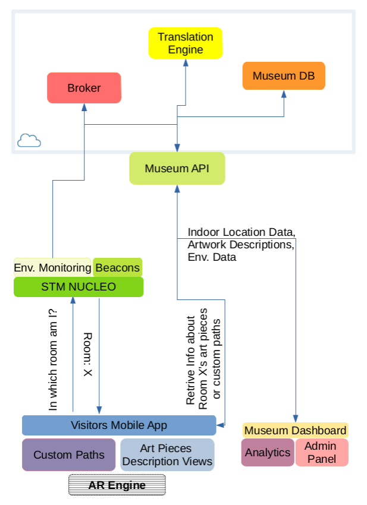

# Architecture   

## High-Level Presentation 

  

   

In principle, thanks to the dashboard, museum administrator will provide a description of the artworks and custom paths and they will be able to monitor live and historical traffic inside museum rooms.  Visitors will download the app, activate Bluetooth and they will be localized thanks to beacons. Beacons should be placed one in each room such that uncertainty regions (location where you are not sure the user is in one room or another) are minimized. The user will select its preferred language and the app will retrieve information (see [Design](./Design.md) for details of the UX). 
On the backend, the key concept is to develop a microservice architecture to obtain modularity and have a dynamic evolving system with a series of independent components to allow continuous integration and development.  
The system can be easily integrated with already existing services. All those microservices are accessed thanks to a middleware that exposes a uniform API for the consumers. The consumers are of two kinds: (1) museum visitors, that use a mobile app, (2) museum curators/managers that will provide data to the users and will use statistical data collected by the system.

### Museum API
The middleware API exposes all the museum services, it will allow visitors' app to retrieve informations of artworks or custom path and museum administrators' app to upload data assets and retrieve indoor traffic data.
It is realized in Nodejs with the Express framework.

### Translation Engine
Is the service in charge of translate text into any language. At the moment we have decided to use the Yandex service that is free of charge. Since the service comes with some limitations in the number of requests per month we will store into the database the translations so that we will reduce the number of requests to the necessary. In the future the service can be changed with any other provider (Google Translate, IBM Watson, ...) without affecting all the other services. We only need to change requests from the Museum API to correct translation service.

### Museum DB
It is a non-relational database that stores all information required. In the [evaluation](Evaluation.md) part we will discuss cloud or on-premise solutions as well as particular DBs. The choice of a NoSQL database is for its non-rigid structure that allows to speed up development. However if there is any constraint on the architecture, the api can be easly adapted to talk and support whatever kind of database.

### Visitors Mobile App
It is in charge of connecting to beacons and send to the museum service the indoor location data. Thanks to those position data it will retrieve information only about artworks in the current room. The user can also select custom paths to visit only part of the museum he is interested in and be guided by the app among the rooms. The AR engine is a future development to make the experience inside the museum more digital and maybe attractive from a child/teenager point of view (second main visitors of the museum). At the moment we are going to develop it only for Android with Android studio. In the future Flutter may be a nice cross-platform tool.

### Museum Dashboard
Thanks to the dashboard museum administrator will upload a description of the artworks and custom paths (Admin Panel) and they will be able to monitor live and historical traffic inside museum rooms and also environmental data to preserve artworks  (Analytics). The PoC will be realized in plain javascript and we will use Bootstrap 4 to quickly build responsive layouts. For a production development we might think to use Flutter also for a web-based dashboard.

### Nucleo Board
The Nucleo board is thought to be chosen either with integrated BLE or with an extension board, it is a matter of costs principally. The board will be in charge of collecting environmental sensors data and to send them to a Broker. From the broker, the middleware will be in charge of consuming them and store them in the DB. The API will provide a uniform interface to clients to either realtime data (from the broker) and historical data (from DB). The board will also broadcast beacons unique identifiers to allow indoor tracking. 

### Broker
The broker will just collect data from the boards when published. As initial solution we will propose to the museum to collect environmental data in aggregated from (for example avg min and max temperature of a given time range). Based on this proposal we decided to use TheThingsNetwork and use their sdk to consume those data.

## Components Interaction  

  

   

With the current architecture, we only differentiate between two frontends (Mobile App, Museum Dashboard) and the backend. The backend choice between on-premise and cloud solutions will be discussed in the [evaluation](Evaluation.md) part. As initial solution we will propose to the museum to collect environmental data in aggregated from (for example avg min and max temperature of a given time range). Based on this proposal we decided to use LoRaWAN as comunication protocol. If more data are needed we might switch to mqtt/mqtt-sn and change the broker accordingly
