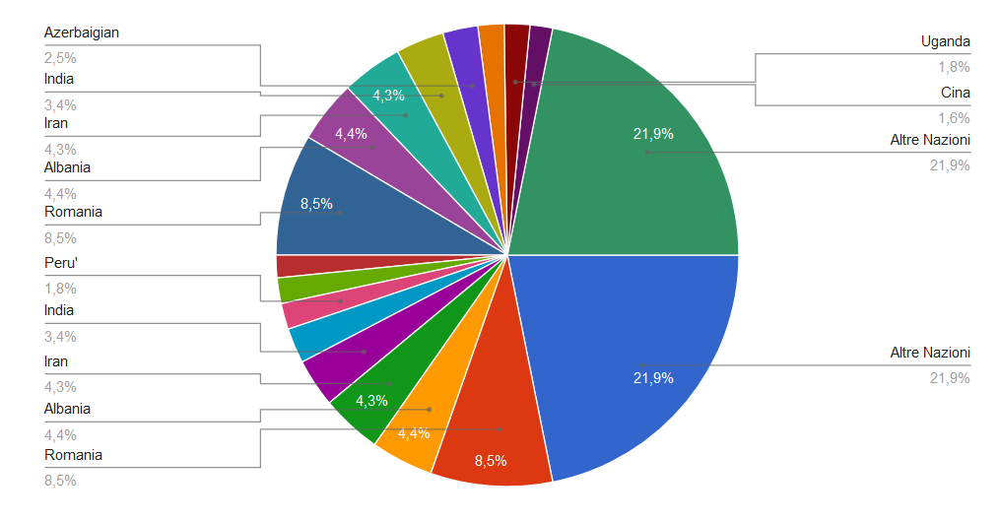
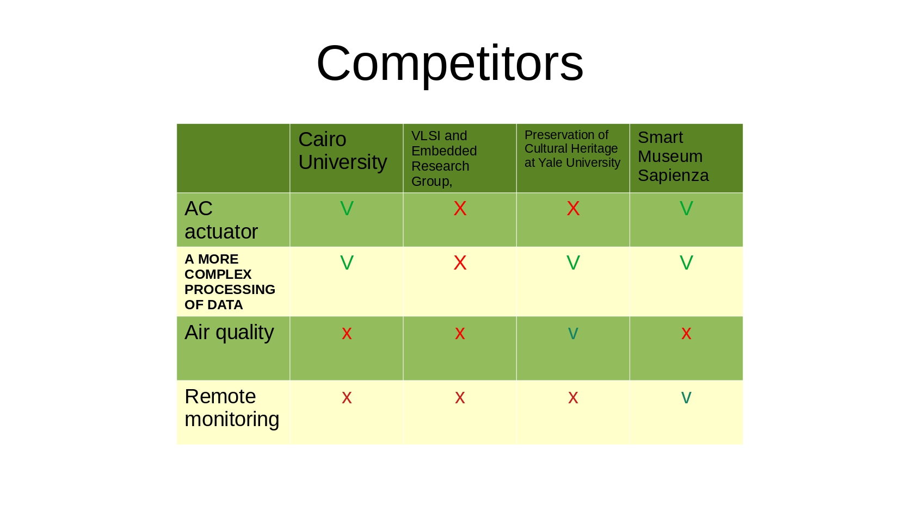
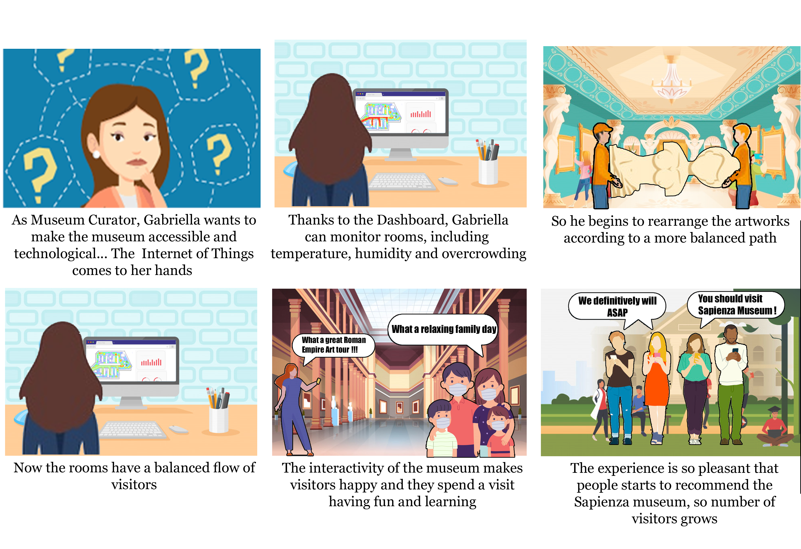

# Design
According to [official Ministry of Education data](http://ustat.miur.it/dati/didattica/italia/atenei-statali/sapienza), Sapienza had more of 10.000 foreign students in 2018 from a variety of countries:
  
During a meeting with museum managers it emerged that the majority of visitors of the museum are students both from Sapienza and outside (expecially art schools). Our idea to transform the Museum of Classical Art at Sapienza is to provide to users a completely digital guide inside the musem. The service will recognize the room in which the user is thanks to BLE Beacons and it will show to the user all the art pieces' descriptions, and digital content associated with the artwork (like audio description, videos etc...) in the room. The system will also allow users to get authomatic translation of the information retrived, in any language and will provide custom paths inside the museum.   
In the meanwhile the museum's managers can (1) monitor traffic and crowding inside the museum, (2) optimize arrangement of artworks to avoid crowded rooms for example, (3) to understand which rooms and which operas get more attention, (4) track user movements for further advanced analysis, (5) sell digital pay-per-view content, (6) provide custom paths inside the musem according to some special criteria. Any modification of those digital content will be immediately available for users.    
  
 The app is tought to be as general as possible and open source so that it might become a real comunity project and spread around museum of the world.
  
Possible future developments might be: 
- integrate an augmented reality engine to make the tour more interactive.
- Provide audio broadcasting to a group of users to implement live tour with a real guide using the app, replacing old radio devices provied by the majority of the museum nowadays.  
- Do not force museum to use BLE beacons but provide a variety of oracles like QR codes, manual selection, AR tags or swipe among rooms for museum with forced routes. 
- Integration with other classmate projects.

# Competitors analysis:
 

## Personas :pouting_man: :pouting_woman:

### :pouting_man: Anand

  

   

__Hard Facts__ 
Anand is a Mongolian curator of a famous museum. Growing up in Mongolia, he graduated in Cultural Heritage and after a long career he became curator. He is not a very technological man but he is lucky, he asked the Sapienza museum for a famous reproduction of a work of art giving consent to the remote monitoring of the rooms.
__Interest and Values__  
He loves to read books at home at night as opposed to going out to  bars. He does like to hang out with a small group of friends at home or  at quiet coffee shops. He cares a lot about looks and  fashion.
In an average day, he tends to drink many cups of American coffee, and he  usually cooks his own healthy dishes. He prefers organic food, however, he’s not always able to afford it.  
__Computer, Internet and TV Use__    
Anand owns a PC and an iPhone. He uses the  internet for his studies to conduct the majority of his preliminary  research and studies user reviews to help him decide upon which books to  read and buy. Anand is also streaming all of his music and he watches  movies online since he does not want to own a TV. He thinks TV’s are outdated and he does not want to waste his time watching TV shows, entertainment, documentaries, or news which he has not chosen and finds 100 % interesting himself.   
__A Typical Day__  
* Anand gets up at 7 am. He eats American breakfast at home and leaves for work at 8.15 every morning. 
* Depending on his schedule. He works all the morning before the lunch. 
* He eats his lunch.
* He continues to work.
* He leaves for home at 6pm.      

### :pouting_woman: Gabriella 

  

   
__Hard Facts__   
Gabriella is 54 years old curator of the Sapienza museum. She is Italian, she graduated in cultural heritage and then supported the master's degree in Conservation of Architectural and Environmental Heritage.
She is wife and mother of two children but above all a woman of great culture, she has an irrepressible passion for art since she was a child, she is also a great supporter of technologies in general but especially for those that  can be put at the service of her museum, in fact she would like to transform her museum into a smart museum making it as accessible and interactive as possible.  

__Interest and Value__  
Gabriella loves watching movies and going out with her family on the weekend, especially when the weather is good, she is a meteoropathic and loves summer but in winter she is more concentrated, obviously without taking away too much space for fun.
But when she wants time for her, she reads a nice book in the living room drinking tea and maybe thinking about some innovation for the museum.  

__Home, internet and tech__   
As already said gabriella is a fan of technology in fact her house is smart, all the appliances are smart: the lights, the television, the audio system, for example on Sunday morning she wakes up and asks Amazon alexa to put some relaxing music in the afternoon she asks alexa for a film to watch on smart TV and then she enjoys watching it with her family.  

__A Typical Day__   
* Wake up at 7 am, breakfast with the family.  
* She takes the kids to school.  
* Then she goes to work at 8:00 am.  
* She eats her lunch.  
*  Afternoon shift at the museum, 2 pm.  
* Then she come back at home at 6 am.  

